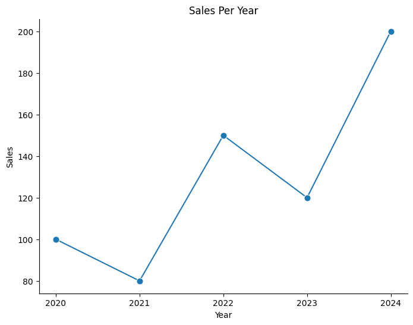
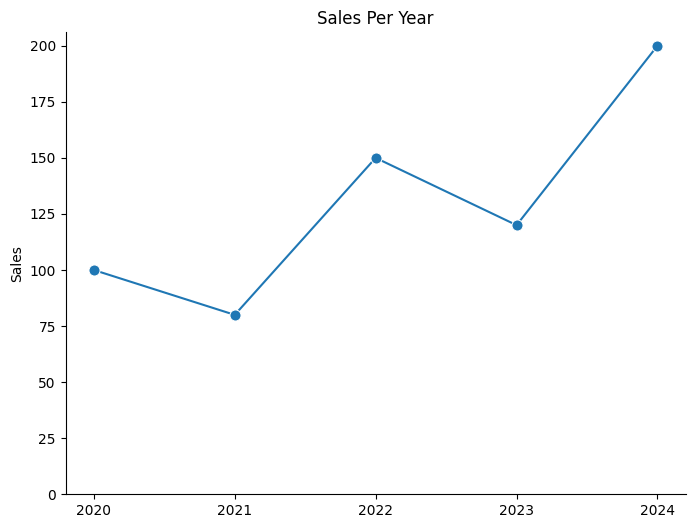
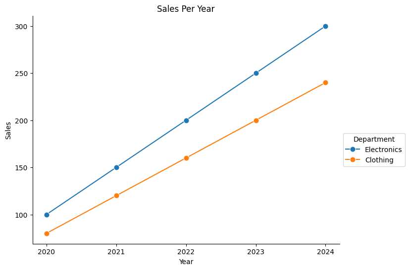
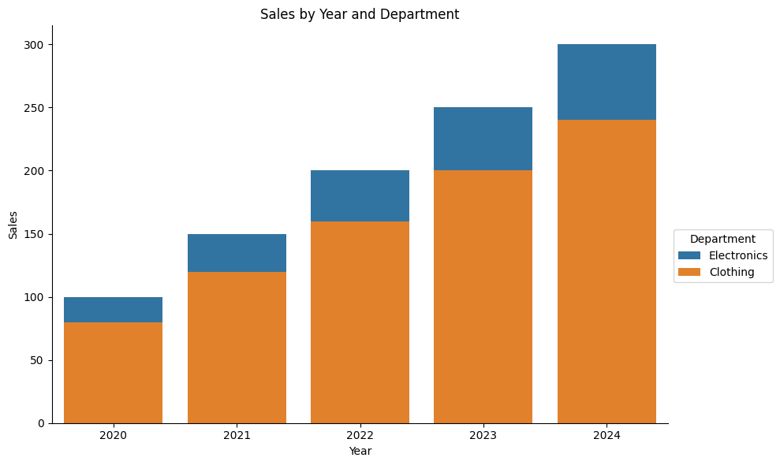
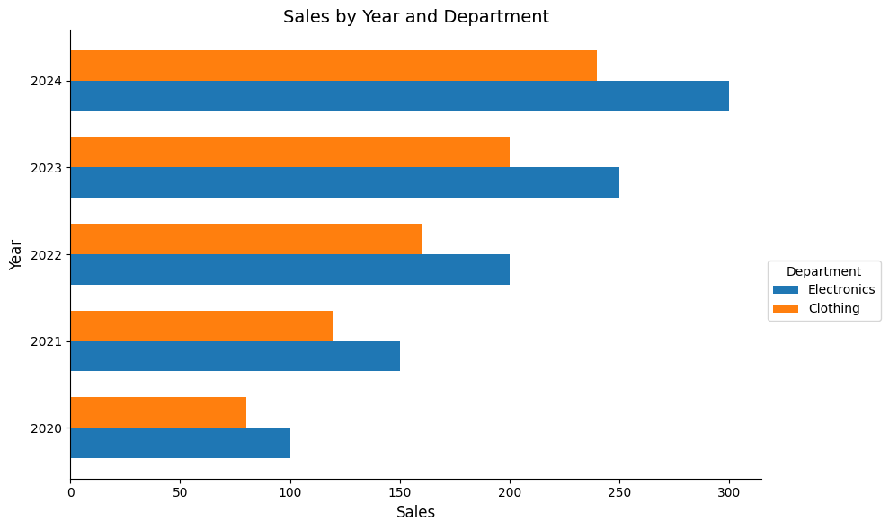

# SAS \<-\> Python :: CHEAT SHEET


# Introduction

This guide aims to familiarise SAS users with Python. Python examples
make use of pandas, numpy, matplotlib & seaborn libraries.

###### import pandas as pd

###### import numpy as np

###### import matplotlib.pyplot as plt

###### import seaborn as sns

###### from matplotlib.ticker import MaxNLocator

## Datasets; drop, keep & rename variables

<div class="grid">

<div class="g-col-4">

##### SAS

``` sas


data new_data;
set old_data;
run;
```

</div>

<div class="g-col-8">

##### python

``` python
old_data = pd.DataFrame(data)
new_data = old_data
```

</div>

</div>

<div class="grid">

<div class="g-col-4">

``` sas
data new_data (keep=id);
set old_data (drop=job_title) ;
run;
```

</div>

<div class="g-col-8">

``` python
new_data = old_data.drop(columns=['job_title'])
# keep column 'id'
new_data = old_data[['id']]
```

</div>

</div>

<div class="grid">

<div class="g-col-4">

``` sas
data new_data (drop= temp: );
set old_data;
run;
```

</div>

<div class="g-col-8">

``` python
new_data = old_data.drop(columns=[col for col in old_data.columns if col.startswith("temp")])
```

</div>

</div>

<div class="grid">

<div class="g-col-4">

``` sas
data new_data;
set old_data;
rename old_name = new_name;
run;
```

</div>

<div class="g-col-8">

``` python
new_data = old_data.rename(columns={"old_name": "new_name"}, inplace=True)
```

</div>

</div>

## Conditional filtering

<div class="grid">

<div class="g-col-4">

``` sas
data new_data;
set old_data;
if Sex = "M";
run;
```

</div>

<div class="g-col-8">

``` python
new_data = old_data[old_data["Sex"] == "M"]
```

</div>

</div>

<div class="grid">

<div class="g-col-4">

``` sas
data new_data;
set old_data;
if year in (2010,2011,2012);
run;
```

</div>

<div class="g-col-8">

``` python
new_data = old_data[old_data["year"].isin([2010,2011,2012])]
```

</div>

</div>

<div class="grid">

<div class="g-col-4">

``` sas
data new_data;
set old_data;
by id ;
if first.id ;
run;
```

</div>

<div class="g-col-8">

``` python
new_data = old_data.groupby("id").head(1)
```

</div>

</div>

<div class="grid">

<div class="g-col-4">

``` sas
data new_data;
set old_data;
if dob > "25APR1990"d;
run;
```

</div>

<div class="g-col-8">

``` python
# Convert 'date_of_birth' to datetime format
old_data["dob"] = pd.to_datetime(old_data["dob"])
# Filter by a specific date (e.g., born after 1990-04-25)
new_data = old_data[old_data["dob"] > "1990-04-25"]
```

</div>

</div>

## New variables, conditional editing

<div class="grid">

<div class="g-col-4">

``` sas
data new_data;
set old_data;
total_income = wages + benefits ;
run;
```

</div>

<div class="g-col-8">

``` python
# Approach 1
old_data["total_income"] = old_data["wages"] + old_data["benefits"]
new_data = old_data

# Approach 2
new_data = old_data.assign(total_income = old_data["wages"] + old_data["benefits"])

# Approach 3
old_data.eval("total_income = wages + benefits", inplace=True)
new_data = old_data
```

</div>

</div>

<div class="grid">

<div class="g-col-4">

``` sas
data new_data;
set old_data;
if hours > 30 then full_time = "Y";
else full_time = "N";
run;
```

</div>

<div class="g-col-8">

``` python
# Approach 1
old_data["full_time"] = old_data["hours"].apply(lambda x: 'Y' if x > 30 else 'N')
new_data = old_data

# Approach 2
old_data["full_time"] = np.where(old_data["hours"] > 90, 'Y', 'N')
new_data = old_data
```

</div>

</div>

<div class="grid">

<div class="g-col-4">

``` sas
data new_data;
set old_data;
if temp > 20 then weather = "Warm";
else if temp > 10 then weather = "Mild";
else weather = "Cold";
run;
```

</div>

<div class="g-col-8">

``` python
# Define a function to implement if-elif-else logic
def calculate_merit(x):
    if x > 20:
        return "Warm"
    elif x > 10:
        return "Mild"
    else:
        return "Cold"

# Approach 1
old_data["weather"] = old_data["temp"].apply(calculate_merit)

# Approach 2
old_data["weather"] = old_data["temp"].apply(lambda x: calculate_merit(x))

new_data = old_data
```

</div>

</div>

## Counting and Summarising

<div class="grid">

<div class="g-col-4">

``` sas
proc freq data = old_data ;
table job_type ;
run;
```

</div>

<div class="g-col-8">

``` python
count = old_data['job_type'].value_counts()

print(count)
```

</div>

</div>

<div class="grid">

<div class="g-col-4">

``` sas
proc freq data = old_data ;
table job_type*region ;
run;
```

</div>

<div class="g-col-8">

``` python
count = old_data.groupby(["job_type", "region"]).size().reset_index(name="count")

print(count)
```

</div>

</div>

<div class="grid">

<div class="g-col-4">

``` sas
proc summary data = old_data nway ;
class job_type region ;
var salary ;
output out = new_data
sum( salary ) = total_salaries ;
run;
```

</div>

<div class="g-col-8">

``` python
new_data = (
    old_data.groupby(["job_type", "region"], as_index=False)
    .agg(
        total_salaries=("salary", "sum"),  # Sum of salaries
        record_count=("salary", "count")  # Count of records
    )
)
```

</div>

</div>

## Sorting and Row-Wise Operations

<div class="grid">

<div class="g-col-4">

``` sas
proc sort data=old_data out=new_data;
by id descending income ;
run
```

</div>

<div class="g-col-8">

``` python
old_data = pd.DataFrame(data)
new_data = old_data.sort_values(by=["id","income"], ascending=[True,False])
```

</div>

</div>

<div class="grid">

<div class="g-col-4">

``` sas
proc sort data=old_data nodup;
by id job_type;
run;
```

</div>

<div class="g-col-8">

``` python
old_data = pd.DataFrame(data)
old_data.sort_values(by=["id","income"], ascending=[True,True])
new_data = df.drop_duplicates(keep="first")
```

</div>

</div>

<div class="grid">

<div class="g-col-4">

``` sas
proc sort data=old_data nodupkey;
by id ;
run;
```

</div>

<div class="g-col-8">

``` python
old_data = pd.DataFrame(data)
old_data = old_data.sort_values(by=["id"], ascending=[True])
old_data.drop_duplicates(subset=["id"], keep="first")
```

</div>

</div>

<div class="grid">

<div class="g-col-4">

``` sas
data new_data;
set old_data;
by id descending income ;
if first.id ;
run;
```

</div>

<div class="g-col-8">

``` python
old_data = pd.DataFrame(data)
old_data = old_data.sort_values(by=["id", "income"], ascending=[True,False])

# Approach 1
new_data = old_data.drop_duplicates(subset=["id"], keep="first")

# Approach 2
new_data = old_data.groupby(["id"], as_index=False).first()
```

</div>

</div>

<div class="grid">

<div class="g-col-4">

``` sas
data new_data;
set old_data;
prev_id= lag( id );
run;
```

</div>

<div class="g-col-8">

``` python
old_data = pd.DataFrame(data)
old_data["prev_id"] = old_data["id"].shift(1)
new_data = old_data
```

</div>

</div>

<div class="grid">

<div class="g-col-4">

``` sas
data new_data;
set old_data;
by id;
counter +1 ;
if first.id then counter = 1;
run;
```

</div>

<div class="g-col-8">

``` python
old_data = pd.DataFrame(data)
old_data["counter"] = old_data.groupby("id").cumcount() + 1
new_data = old_data
```

</div>

</div>

## Converting and Rounding

<div class="grid">

<div class="g-col-4">

``` sas
data new_data;
set old_data ;
text_var = put( 5 , 8. );
run;
```

</div>

<div class="g-col-8">

``` python
old_data = pd.DataFrame(data)
old_data["text_var"] = 5

# Approach 1
old_data["text_var"] = old_data["text_var"].astype(str)
new_data = old_data
```

</div>

</div>

<div class="grid">

<div class="g-col-4">

``` sas
data new_data;
set old_data ;
num_var = input("5" , 8. );
run;
```

</div>

<div class="g-col-8">

``` python
old_data = pd.DataFrame(data)
old_data["num_var"] = "5"

# Approach 1
old_data["num_var"] = old_data["num_var"].astype(int)

# Approach 2
old_data["num_var"] = pd.to_numeric(old_data["num_var"])

new_data = old_data
```

</div>

</div>

<div class="grid">

<div class="g-col-4">

``` sas
data new_data;
set old_data ;
nearest_5 = round( x , 5 );
run;
```

</div>

<div class="g-col-8">

``` python
old_data = pd.DataFrame(data)

old_data["nearest_5"] = old_data["x"].round(-1)
new_data = old_data
```

</div>

</div>

<div class="grid">

<div class="g-col-4">

``` sas
data new_data;
set old_data ;
two_decimals = round( x , 0.01)
run;
```

</div>

<div class="g-col-8">

``` python
old_data = pd.DataFrame(data)

old_data["two_decimals"] = old_data["x"].round(2)
new_data = old_data
```

</div>

</div>

## Combining datasets

<div class="grid">

<div class="g-col-4">

``` sas
data new_data ;
set data_1 data_2 ;
run;
```

</div>

<div class="g-col-8">

``` python
data_1 = pd.DataFrame(data1)
data_2 = pd.DataFrame(data2)

# Concatenate vertically (row-wise)
new_data = pd.concat([data_1,data_2], axis=0, ignore_index=True)
```

**axis=0**: Stacks data row-wise (default). <br> **ignore_index=True**:
Resets the index, creating a continuous index across the rows.

</div>

</div>

<div class="grid">

<div class="g-col-4">

``` sas
data new_data ;
merge data_1 (in= in_1) data_2 ;
by id ;
if in_1 ;
run;
```

</div>

<div class="g-col-8">

``` python
data_1 = pd.DataFrame(data1)
data_2 = pd.DataFrame(data2)

new_data = pd.merge(data_1, data_2, on="id", how="left", indicator=True)
```

**indicator=True**: argument in pandas.merge() adds a special column
called \_merge to the resulting DataFrame. This column indicates the
source of each row in the merged DataFrame. Possible Values in \_merge
Column `left_only`, `right_only`, `both`. <br>

</div>

</div>

<div class="grid">

<div class="g-col-4">

``` sas
data new_data ;
merge data_1 (in= in_1) data_2 ;
by id ;
run;
```

</div>

<div class="g-col-8">

``` python
data_1 = pd.DataFrame(data1)
data_2 = pd.DataFrame(data2)

new_data = pd.merge(data_1, data_2, on="id", how="outer", indicator=True)
```

a **full join** in python is accomplished by specifying `how="outer"` in
the merge() function. <br>

###### How to Use \_merge for Filtering generated in the dataframe by indicator=True, assume that how=‘outer’ is used

``` python
data_1 = pd.DataFrame(data1)
data_2 = pd.DataFrame(data2)

# right join
new_data = new_data[new_data['_merge'] == 'right_only'].drop(columns=['_merge'])

# both
new_data = new_data[new_data['_merge'] == 'both'].drop(columns=['_merge'])
```

</div>

</div>

## String Manipulation

<div class="grid">

<div class="g-col-4">

``` sas
data new_data;
set old_data;
if find( job_title , "Health" );
run
```

</div>

<div class="g-col-8">

``` python
old_data = pd.DataFrame(data)
new_data = old_data[old_data["job_title"].str.contains("Health",case=False, na=False)]
```

- `case=False` parameter: case-insensitive search.
- If you omit `na=False`, rows with NaN in job_title will raise an
  error.

</div>

</div>

<div class="grid">

<div class="g-col-4">

``` sas
data new_data;
set old_data;
substring = substr( big_string , 3 , 4 ); 
run;
```

</div>

<div class="g-col-8">

``` python
old_data = pd.DataFrame(data)
old_data["substring"] = old_data["big_string"].str[2:6]
new_data = old_data
```

</div>

</div>

<div class="grid">

<div class="g-col-4">

``` sas
data new_data;
set old_data;
address = tranwrd( address , "Street" , "St" );
run;
```

</div>

<div class="g-col-8">

``` python
old_data = pd.DataFrame(data)
old_data["address"] = old_data["address"].str.replace("Street", "St",case=False, regex=False)
new_data = old_data
```

- Set `regex=False` to ensure it treats the input as plain text, not a
  regular expression.

</div>

</div>

<div class="grid">

<div class="g-col-4">

``` sas
data new_data;
set old_data;
house_number = compress( address , , "dk" );
run;
```

</div>

<div class="g-col-8">

``` python
old_data = pd.DataFrame(data)
old_data["house_number"] = old_data["address"].str.extract(r"(\d+)", expand=False)
new_data = old_data
```

- `r"(\d+)"` In Python, prefixing a string with r (e.g., r”some_string”)
  tells Python to treat the string as a raw string.This means that
  escape characters (like `\`) are treated literally and not as escape
  sequences. For example, `\n` would be interpreted as two characters
  `\` and `n`, rather than as a newline. <br>
- `expand=False` ensures that the result is a single pandas Series.

</div>

</div>

## Transpose/Pivot

<div class="grid">

<div class="g-col-4">

``` text
proc transpose data=long_data out=wide_data;
by student ;
id subject ;
var grade ;
run;
```

</div>

<div class="g-col-8">

``` python
long_data = pd.DataFrame(data)
wide_data = long_data.pivot(index='student', columns='subject', values='grade').reset_index()
```

</div>

</div>

<div class="grid">

<div class="g-col-4">

``` text
proc transpose data=wide_data
out=long_data(rename=(col1=grade)) name=subject;
by student ;
var English Irish Maths;
run;
```

</div>

<div class="g-col-8">

``` python
wide_data = pd.DataFrame(data)

# Dynamically determine value_vars by excluding id_vars
id_vars = ['student']  # Columns to keep
value_vars = [col for col in wide_data.columns if col not in id_vars]  # Columns to melt

# Melt the wide data into long format
long_data = wide_data.melt(
    id_vars=id_vars,
    value_vars=value_vars,  # Dynamically determined
    var_name='subject',
    value_name='grade'
)
```

</div>

</div>

## Creating functions to modify datasets

<div class="grid">

<div class="g-col-4">

``` text
%macro add_variable(dataset_name);
data &dataset_name;
set &dataset_name;
new_variable = 1;
run;
%mend;

%add_variable( my_data );
```

</div>

<div class="g-col-8">

``` python
def add_variable(dataset_name):
  dataset_name['new_variable'] = 1 
  return dataset_name

my_data = add_variable(my_data)
```

</div>

</div>

## File operations

<div class="grid">

<div class="g-col-4">

``` text
proc export data = my_data
outfile = "my_file.csv" dbms = csv replace;
run;
```

</div>

<div class="g-col-8">

``` python
my_data = pd.DataFrame(data)

my_data.to_csv('my_file.csv', index=False)
```

</div>

</div>

<div class="grid">

<div class="g-col-4">

``` text
proc import datafile = "my_file.csv"
out = my_data dbms = csv;
run;
```

</div>

<div class="g-col-8">

``` python
my_data = pd.read_csv('my_file.csv')
```

</div>

</div>

## Some plotting in R vs Python

<div class="grid">

<div class="g-col-4">

``` r
ggplot( my_data , aes( year , sales ) ) +
geom_point( ) + geom_line( )
```

</div>

<div class="g-col-8">

``` python
# Create the plot
plt.figure(figsize=(8, 6))
sns.lineplot(data=my_data, x='year', y='sales', marker='o', markersize=8)  # Line with points

# Set the x-axis to display only integer values (no fractional years)
plt.gca().xaxis.set_major_locator(MaxNLocator(integer=True))

# Remove grid lines
plt.grid(False)

# Access the current axis
ax = plt.gca()

# Remove the top and right spines (often associated with x2 and y2 axes)
ax.spines['top'].set_visible(False)
ax.spines['right'].set_visible(False)

# Add titles and labels
plt.title('Sales Over Time')
plt.xlabel('Year')
plt.ylabel('Sales')

# Display grid and show the plot
plt.show()
```



</div>

</div>

<div class="grid">

<div class="g-col-4">

``` r
ggplot( my_data , aes( year , sales ) ) +
geom_point( ) + geom_line( ) + 
ylim(0, 40) + 
labs(x = "" , y = "Sales per year")
```

</div>

<div class="g-col-8">

``` python
# Create the plot
plt.figure(figsize=(8, 6))
sns.lineplot(data=my_data, x='year', y='sales', marker='o', markersize=8)  # Line with points

# Set the x-axis to display only integer values (no fractional years)
plt.gca().xaxis.set_major_locator(MaxNLocator(integer=True))

# Remove grid lines
plt.grid(False)

# Ensure the y-axis starts from 0
plt.ylim(0, None)  # None lets matplotlib automatically determine the upper limit

# Access the current axis
ax = plt.gca()

# Remove the top and right spines (often associated with x2 and y2 axes)
ax.spines['top'].set_visible(False)
ax.spines['right'].set_visible(False)

# Add titles and labels
plt.title('Sales Over Time')
plt.xlabel('Year')
plt.ylabel('Sales')

# Display grid and show the plot
plt.show()
```



</div>

</div>

<div class="grid">

<div class="g-col-4">

``` r
ggplot(my_data, aes( year, sales, colour = dept) ) +
geom_point( ) + geom_line( ) 
```

</div>

<div class="g-col-8">

``` python
# Create the plot
plt.figure(figsize=(8, 6))
sns.lineplot(data=my_data, x='year', y='sales', hue='dept' ,marker='o', markersize=8)  # Line with points

# Set the x-axis to display only integer values (no fractional years)
plt.gca().xaxis.set_major_locator(MaxNLocator(integer=True))

# Remove grid lines
plt.grid(False)

# Ensure the y-axis starts from 0
plt.ylim(0, None)  # None lets matplotlib automatically determine the upper limit

# Access the current axis
ax = plt.gca()

# Remove the top and right spines (often associated with x2 and y2 axes)
ax.spines['top'].set_visible(False)
ax.spines['right'].set_visible(False)

# Add titles and labels
plt.title('Sales Over Time')
plt.xlabel('Year')
plt.ylabel('Sales')

# Display grid and show the plot
plt.show()
```



</div>

</div>

<div class="grid">

<div class="g-col-4">

``` r
ggplot( my_data , aes( year, sales, fill = dept) ) +
geom_col( ) 
```

</div>

<div class="g-col-8">

``` python
# Create the bar plot
plt.figure(figsize=(10, 6))
sns.barplot(data=my_data, x='year', y='sales', hue='dept', dodge=False)

# Add titles and labels
plt.title('Sales by Year and Department')
plt.xlabel('Year')
plt.ylabel('Sales')

# Place the legend outside to the right
plt.legend(title='Department', loc='upper left', bbox_to_anchor=(1, 0.5))

# Adjust layout for better spacing
plt.tight_layout()

# Show the plot
plt.show()
```



</div>

</div>

<div class="grid">

<div class="g-col-4">

``` r
ggplot( my_data , aes( year, sales, fill = dept) ) +
geom_col( position = "dodge" ) + coord_flip( )
```

</div>

<div class="g-col-8">

``` python
# Prepare data for horizontal dodged bars
unique_years = sorted(my_data['year'].unique())

departments = my_data['dept'].unique()

bar_width = 0.35  # Width of each bar
indices = np.arange(len(unique_years))  # Positions for the years

# Create the figure and axes
plt.figure(figsize=(10, 6))

# Plot bars for each department
for i, dept in enumerate(departments):
    sales = my_data[my_data['dept'] == dept]['sales']
    plt.barh(indices + i * bar_width, sales, bar_width, label=dept)

# Add year labels to the y-axis
plt.yticks(indices + bar_width / 2, unique_years)
plt.xlabel('Sales', fontsize=12)
plt.ylabel('Year', fontsize=12)
plt.title('Sales by Year and Department', fontsize=14)

# Add the legend to the right
plt.legend(title='Department', loc='upper left', bbox_to_anchor=(1, 0.5))

# Adjust layout for better spacing
plt.tight_layout()

# Display the plot
plt.show()
```



</div>

</div>
